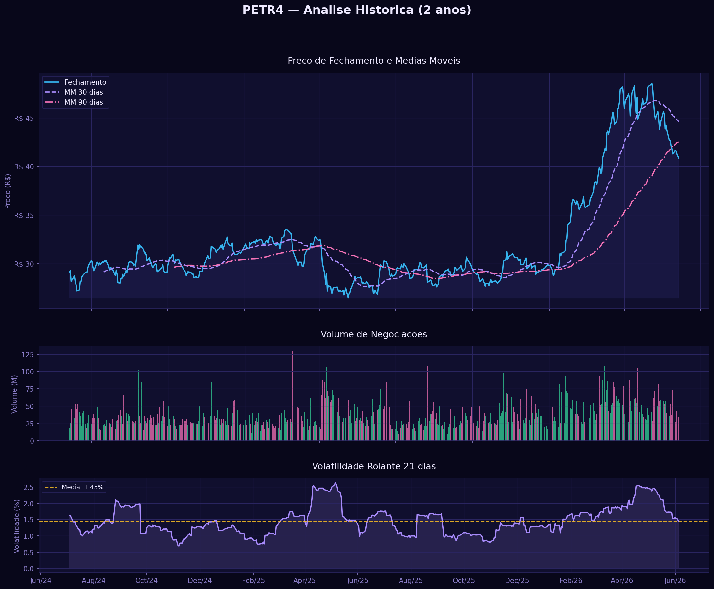
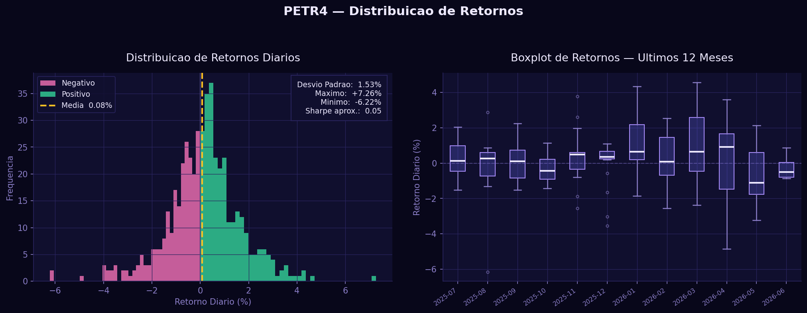

# 📈 Análise de Ações — PETR4

Análise exploratória do histórico de 2 anos das ações da Petrobras (PETR4) na B3, cobrindo preço de fechamento, médias móveis, volume de negociações, volatilidade e distribuição de retornos diários.

> *Dados reais coletados via yFinance diretamente da B3.*

---

## Contexto

A Petrobras (PETR4) é uma das ações mais negociadas da bolsa brasileira e referência do setor de energia. Analisar seu comportamento histórico permite entender padrões de tendência, risco e volatilidade — habilidades essenciais em análise financeira quantitativa.

Este projeto aplica técnicas de análise de séries temporais financeiras para responder perguntas como:

- Qual foi a tendência de preço nos últimos 2 anos?
- Em quais períodos o ativo apresentou maior volatilidade?
- Como se distribui o retorno diário — há assimetria ou caudas pesadas?
- O volume de negociações acompanha os movimentos de preço?

---

## Análises Realizadas

### 1. Preço de Fechamento e Médias Móveis
Visualização da série histórica de fechamento com sobreposição de médias móveis de **30 dias** (tendência de curto prazo) e **90 dias** (tendência de longo prazo), permitindo identificar cruzamentos e mudanças de tendência.

### 2. Volume de Negociações
Barras de volume coloridas por direção do retorno do dia: **verde** quando o fechamento subiu, **rosa** quando caiu — facilitando a leitura de pressão compradora vs. vendedora.

### 3. Volatilidade Rolante (21 dias)
Desvio padrão dos retornos calculado em janela móvel de 21 pregões (equivalente a ~1 mês útil), evidenciando períodos de maior instabilidade do ativo.

### 4. Distribuição de Retornos Diários
Histograma com separação visual entre retornos positivos e negativos, acompanhado de estatísticas descritivas (desvio padrão, máximo, mínimo, Sharpe aproximado).

### 5. Boxplot Mensal de Retornos
Comparação da dispersão dos retornos diários nos últimos 12 meses, revelando sazonalidade e meses com maior ou menor variação.

---

## Visualizações

| Gráfico | Descrição |
|---|---|
| `petr4_historico.png` | Painel com preço + médias móveis, volume e volatilidade |
| `petr4_retornos.png` | Distribuição de retornos e boxplot mensal |

<br>





---

## Principais Conclusões

- As **médias móveis** revelam as tendências de curto e longo prazo do ativo, com cruzamentos indicando possíveis pontos de reversão
- O **volume colorido** facilita identificar dias de maior pressão compradora ou vendedora
- A **volatilidade rolante** aponta períodos de maior risco — comuns em momentos de incerteza macroeconômica ou de resultados da empresa
- A **distribuição de retornos** é aproximadamente normal com **caudas pesadas** (*fat tails*), típico de ações de commodities com exposição a variações de câmbio e preço do petróleo

---

## 🛠️ Ferramentas Utilizadas

| Categoria | Ferramenta | Uso |
|---|---|---|
| Linguagem |  | Desenvolvimento completo |
| Dados |  | Manipulação e análise de séries temporais |
| Dados |  | Coleta de dados reais da B3 |
| Visualização |  | Gráficos de preço, volume e volatilidade |
| Visualização |  | Estilo e paleta de cores |
| Ambiente |  | Notebook interativo |
| Versionamento |  | Controle de versão |

---

## Como Rodar

**1. Instale as dependências:**
```bash
pip install pandas numpy matplotlib seaborn yfinance
```

**2. Execute o notebook:**

Abra `analise.ipynb` no Jupyter ou VS Code e execute as células em ordem.

Ou rode o script diretamente para gerar os gráficos:
```bash
python gerar_graficos.py
```

> Os dados são baixados automaticamente via yFinance (necessário conexão com internet).

---

*Projeto desenvolvido por Yasmin Guedes — Portfólio de Transição para Dados*
